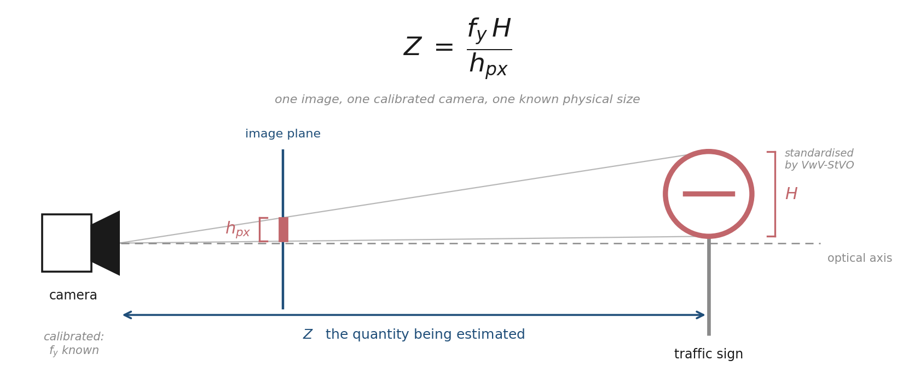
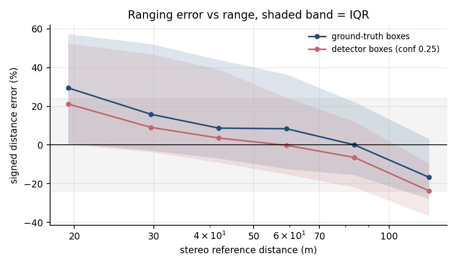
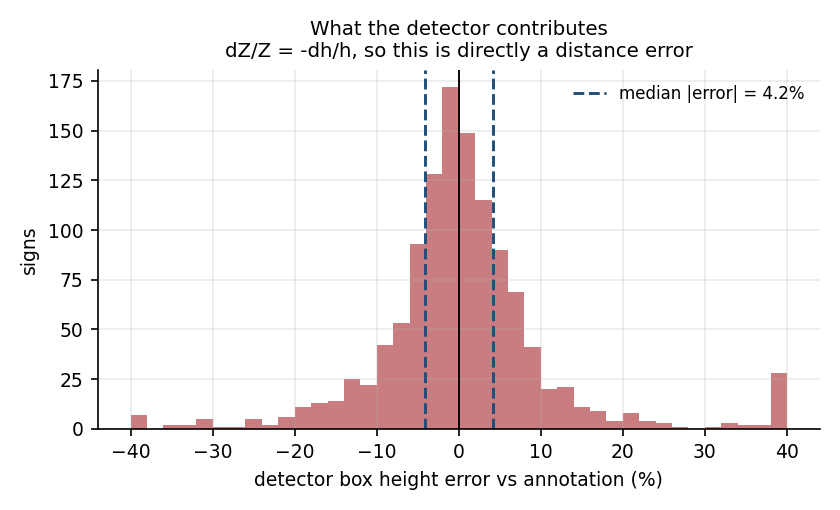
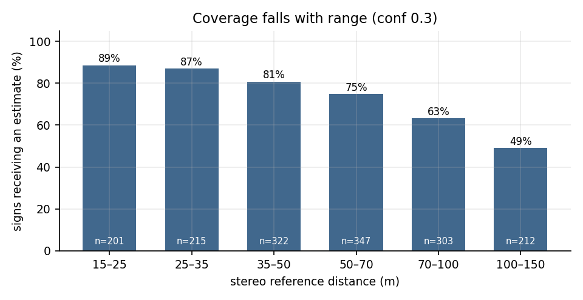
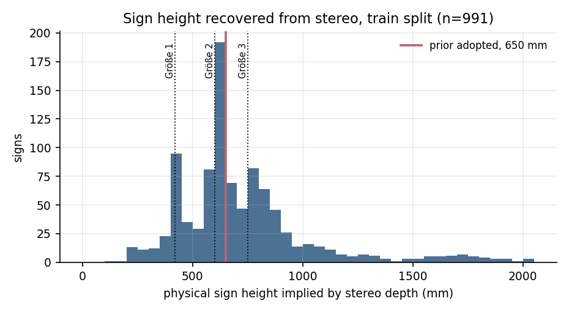
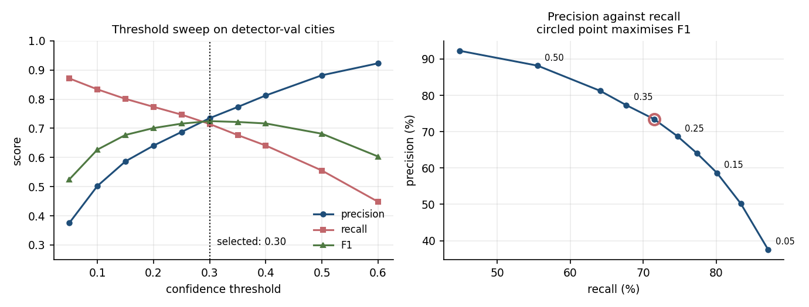

# Monocular Sign Ranging



Estimating how far away a traffic sign is, from one image of a calibrated camera, using the fact that German traffic signs are manufactured in standard sizes.

Validated against Cityscapes stereo disparity. Cityscapes is used under its non-commercial licence and is not redistributed here; please cite Cordts et al., *The Cityscapes Dataset for Semantic Urban Scene Understanding*, CVPR 2016.

> [!IMPORTANT]
> Results come from the Cityscapes **val** split (frankfurt, lindau, munster), which was held out from all fitting and tuning. The size prior was fitted on train cities. The detector was trained on 15 train cities, with its checkpoint and confidence threshold both selected on 3 further train cities. Earlier development runs did evaluate on val. Those results were discarded and are documented at the end.

Distance requires known camera intrinsics, so this is single-image ranging from a **calibrated** camera, not from an arbitrary photograph. Stereo is used only as an offline evaluation reference. Inference needs one left-camera image and `fy`.

## Result

Confidence 0.30, one-to-one matching at IoU 0.5.

**Evaluation population**: annotated `traffic sign` polygons whose axis-aligned box is at least 15 px in height, at least 8 px in width, near-square (|w/h − 1| < 0.25), with at least 20% valid disparity inside the box and a stereo reference between 2 and 250 m. Rectangular direction signs and Zusatzzeichen are excluded, since they have no standard height. That leaves **1,480 signs across 500 images**.

| | Value |
|---|---|
| Median absolute relative error | **23.0%**, 95% CI [21.4, 24.4] |
| Signed error IQR | −18% to +35% |
| Coverage | **80.1%** of signs receive an estimate |
| Detection precision | 0.730 |
| Detection recall | 0.637 |
| Range covered | 14–118 m (p5–p95) |



Stratified by stereo reference range. `MdARE det` covers signs the detector found. `MdARE all` scores a miss as infinite error. `H det` is the median physical height that the *detected* signs in that stratum actually turn out to have.

| Range | Signs | Coverage | H all | H det | Bias | p25 | p75 | MdARE det | 95% CI | MdARE all |
|---|---:|---:|---:|---:|---:|---:|---:|---:|---:|---:|
| 15–25 m | 201 | 88.6% | 502 mm | 560 mm | +16.7% | −1% | +52% | 32.4% | [24.4, 42.8] | 42.3% |
| 25–35 m | 215 | 87.0% | 561 mm | 591 mm | +8.8% | −4% | +47% | 22.8% | [20.4, 32.3] | 34.7% |
| 35–50 m | 322 | 80.7% | 598 mm | 619 mm | +2.9% | −9% | +39% | 22.3% | [17.4, 25.3] | 31.1% |
| 50–70 m | 347 | 74.9% | 600 mm | 637 mm | −0.3% | −15% | +24% | 19.4% | [15.0, 23.3] | 28.4% |
| 70–100 m | 303 | 63.4% | 650 mm | 682 mm | −8.8% | −22% | +7% | 16.7% | [14.9, 20.1] | 33.3% |
| 100–150 m | 212 | 49.1% | 785 mm | 823 mm | −23.9% | −37% | −11% | 24.2% | [21.6, 27.9] | undefined |

Confidence intervals come from a 2,000-sample bootstrap over individual signs. Signs within an image are correlated, so these are optimistic. An image-clustered bootstrap would widen them.

## Why the error looks like this

The bias column is not noise. With annotation boxes and a fixed prior $H_0$, the error reduces exactly to

$$
\frac{Z_{\text{pred}}}{Z_{\text{true}}} - 1 = \frac{H_0}{H_{\text{actual}}} - 1
$$

Distance error depends on one thing: how wrong the assumed physical height is for that particular sign. Check the 15–25 m row against `H det`. 650/560 − 1 = +16.1%, against +16.7% measured. The residual is detector box-height error, which breaks exactness once predicted boxes replace annotation ones. The identity is exact in the geometry-only stage.

So the bias trend says something about German roads rather than about the pipeline. Signs near the camera have a median height of 560 mm; signs beyond 100 m, 823 mm. Small signs sit close to the carriageway and only get annotated when nearby. Large signs (motorway plates, multi-plate assemblies) stay legible and annotated from far off. A single 650 mm prior is too large near and too small far, and the bias crosses zero around 60 m where the population's median height passes the prior.

**Error is not flat with range.** It runs 32.4% at 15–25 m down to 16.7% at 70–100 m, then back to 24.2% past 100 m. Accuracy is worst close to the vehicle, which is where an assistance system needs it most.

An earlier version of this README stratified by box height in pixels and reported a roughly flat error. That is misleading. Requiring a 60 px box at 18 m implicitly requires a sign taller than 490 mm, so binning on box height selects on the very quantity that causes the error. The box-height view is kept below for comparison.

| Box height | Signs | Coverage | H det | Bias | MdARE det | MdARE all |
|---|---:|---:|---:|---:|---:|---:|
| 0–15 px | 321 | 29.3% | 600 mm | −1.6% | 21.2% | undefined |
| 15–30 px | 730 | 69.9% | 612 mm | +3.0% | 22.1% | 36.9% |
| 30–60 px | 527 | 89.0% | 629 mm | +1.6% | 24.0% | 29.7% |
| 60+ px | 223 | 92.4% | 751 mm | −12.4% | 22.2% | 24.0% |

Three of its four bins have nearly identical implied heights (600 / 612 / 629 mm). That compresses the real trend into the last bin and makes the error look range-independent.

## Does the detector cost accuracy?

Measured on identical signs, rather than inferred from two similar-looking tables.

| Range | n | MdARE, annotation box | MdARE, detector box | Paired difference | 95% CI |
|---|---:|---:|---:|---:|---:|
| 15–25 m | 178 | 31.9% | 32.4% | +0.23% | [−0.29, +0.64] |
| 25–35 m | 186 | 23.4% | 22.7% | −0.57% | [−1.55, +0.58] |
| 35–50 m | 260 | 21.2% | 22.3% | −0.06% | [−0.80, +0.63] |
| 50–70 m | 253 | 19.9% | 18.5% | −0.45% | [−1.24, +0.15] |
| 70–100 m | 162 | 13.2% | 16.1% | +1.09% | [−0.10, +2.38] |
| 100–150 m | 64 | 29.0% | 33.5% | −0.27% | [−1.46, +1.94] |
| **all ≥15 px** | **1,185** | **22.08%** | **23.04%** | **+0.04%** | **[−0.28, +0.33]** |

The paired difference is the per-sign change in absolute error when the detector box replaces the annotation box. Every interval includes zero, so **no statistically resolvable median difference was observed**. That is weaker than saying there is none.

The boxes are not perfect, though. Detector box heights differ from annotation heights by **4.16%** in median absolute terms.



Since $\Delta Z / Z \approx -\Delta h / h$, that is a real 4.2% contribution to distance error. It stays invisible in the totals because it sits underneath a size-prior error five times larger. The paired test, not any error-combination argument, is what establishes this.

The distribution is heavy-tailed: p95 is 24.6% and p99 is 53.9%, so about 1% of detections produce distances wrong by more than half. The median is not a bound.

The size prior, not box regression, limits this system. Effort spent on better localisation is wasted until the prior is fixed.

## What detection actually costs



Coverage, not accuracy. One sign in five produces no estimate, and the misses cluster: 88.6% coverage at 15–25 m falls to 49.1% beyond 100 m.

The `MdARE all` column makes it visible. At 35–50 m it reads 31.1% against 22.3% for the detected subset. The gap is the cost of signs never seen at all.

## How I got here

The first plan was a GTSDB detector plus Depth Anything V2, with `near`/`mid`/`far` outputs. I dropped that because the relative-depth output normalises per image. The same predicted value means different real distances in different frames, so a `near` in one frame can be further away than a `mid` in another.

Depth Anything V2 does also ship **metric** depth variants, fine-tuned on Virtual KITTI 2 for outdoor scenes. I did not benchmark those, so a calibrated monocular-depth baseline is a missing comparison rather than a ruled-out option.

What replaced it:

$$
Z = \frac{f_y H_{\text{real}}}{h_{\text{px}}}
$$

GTSDB has no camera intrinsics and no depth ground truth, so there was nothing to validate against. Cityscapes has intrinsics, stereo disparity, and traffic-sign polygons, so validation moved there.

I also built it backwards on purpose: geometry first with annotation boxes, detector last. If the detector had come first and the distances were wrong, there would be no way to separate bad boxes from a bad size assumption from bad intrinsics.

## Is the stereo reference trustworthy?

Cityscapes disparity is a precomputed stereo estimate, not laser ground truth, so it is called the **stereo reference** throughout. It carries its own error, worst at small disparity.

The specific worry is contamination. A sign is a thin plate, often against sky, and the median disparity inside its bounding box might be picking up background. As a sensitivity check I compared median disparity against the 90th percentile, which corresponds to the nearer surface and is less affected by distant background.

The gap is 2–4%, largest on the smallest boxes (3.9% below 15 px, 2.0% above 60 px). That direction is consistent with some boundary contamination, since a small box has proportionally more edge. The magnitude is an order below the ranging error being measured, so contamination at this level would not change any conclusion here. This is a sensitivity check, not a proof that contamination is absent.

A stronger version would rasterise and erode the annotation polygon rather than using its bounding box. That is not done here.

Across five train cities, 4,863 of 5,512 annotated signs (88%) yield a usable reference distance.

## The size prior, and the floor it sets

Inverting the ranging equation on 991 near-square train signs at least 30 px high gives a median implied height of 651 mm, IQR 574–842 mm.



The main peak at 600–700 mm is a useful check on the whole chain. If the disparity decode, baseline or focal length were wrong, that peak would sit at an arbitrary value rather than near a documented standard.

Reading size classes off this histogram is harder than it looks. German sign dimensions are **shape-dependent**, and the VwV-StVO figures are not all vertical heights. Größe 2 is 600 mm diameter for round signs, but 900 mm *side length* for triangles, which is 779 mm of vertical extent. The near-square subset mixes circles, squares and triangles, so the spread reflects mixed geometry as well as mixed size classes. The model uses $H_{\text{real}} = 0.650\text{ m}$, one empirical central value across all of them.

Re-deriving on val gives 641 mm, so the prior transfers. Val produces a wider spread because its distribution is more bimodal: 17.7% of clean val signs sit in the 400–500 mm bin against 13.1% on train.

**The floor this sets.** For the observed IQR:

- actual height 574 mm gives distance error **+13.2%**
- actual height 842 mm gives distance error **−22.8%**

Roughly **−23% to +13%**, a 36-point interval, before a single pixel is measured. Measured signed IQRs run from 53 points at 15–25 m down to 26 points at 100–150 m, straddling that estimate. The inferred-height distribution also carries stereo error, sign orientation and annotation imprecision, so this is an estimate rather than a clean decomposition.

## The detector

Single-class YOLO11s at `imgsz=1280`, trained on 15 Cityscapes cities (2,465 images, 17,869 boxes). Three more train cities are held out for checkpoint and threshold selection.

Resolution matters more than anything else here. Cityscapes is 2048×1024 and the median sign is 22 px on its short side. At the usual `imgsz=640` that sign scales to roughly 7 px, below the finest stride-8 feature spacing, which makes localisation and classification substantially harder. At 1280 it is 13.8 px.

Ultralytics-reported metrics on the detector-validation cities: precision 0.769, recall 0.676, mAP@50 0.767, mAP@50-95 0.485. My own evaluation on those cities gives lower numbers because it uses strict one-to-one matching and includes images with no annotated sign.

The detector was trained only on images containing at least one retained sign. Background-only frames were excluded, which may worsen false-positive behaviour. Retraining with negatives is an untested improvement.

## Choosing the confidence threshold

Swept on the detector-validation cities, never on the test split.

| conf | Precision | Recall | F1 | FP/image |
|---|---:|---:|---:|---:|
| 0.05 | 0.375 | 0.871 | 0.525 | 7.54 |
| 0.10 | 0.502 | 0.834 | 0.627 | 4.30 |
| 0.15 | 0.587 | 0.801 | 0.677 | 2.94 |
| 0.20 | 0.641 | 0.774 | 0.701 | 2.26 |
| 0.25 | 0.688 | 0.747 | 0.716 | 1.77 |
| **0.30** | **0.735** | **0.715** | **0.725** | **1.34** |
| 0.35 | 0.773 | 0.677 | 0.722 | 1.03 |
| 0.40 | 0.813 | 0.641 | 0.717 | 0.77 |
| 0.50 | 0.882 | 0.555 | 0.681 | 0.39 |
| 0.60 | 0.923 | 0.448 | 0.603 | 0.19 |



Best F1 at 0.30. The curve is flat across 0.25–0.35 (0.716 / 0.725 / 0.722), so there is no sharp knee. An earlier three-point sweep appeared to show one; denser sampling showed that was an artifact of the spacing.

## False positives

At conf 0.30 on the test split: 2,486 true positives, 919 false positives, precision 0.730 across all 500 images including the 28 with no annotated sign.

Relaxing the match criterion, with the full one-to-one assignment recomputed from scratch at each threshold:

| Match IoU | TP | FP | Precision | Recall |
|---|---:|---:|---:|---:|
| 0.5 | 2,486 | 919 | 0.730 | 0.637 |
| 0.4 | 2,561 | 844 | 0.752 | 0.657 |
| 0.3 | 2,604 | 801 | 0.765 | 0.668 |
| 0.2 | 2,622 | 783 | 0.770 | 0.672 |
| 0.1 | 2,636 | 769 | 0.774 | 0.676 |

769 of 919 false positives, **84%**, overlap no unclaimed annotated sign even at IoU 0.1. Only 150 are explicable as poor localisation on a real sign. Duplicate detections on an already-matched sign remain false positives at every threshold, as they should.

Strict precision is 0.730. The 0.774 at IoU 0.1 is precision under a different matching rule, not a corrected value. Attributing the difference to annotation ambiguity would require inspecting the false-positive crops, which has not been done.

False-positive box heights track the real sign distribution closely, so a simple box-height or range threshold is unlikely to separate them.

## What is excluded and why

Signs below 15 px box height get coverage but no headline error figure. At that size the predicted range exceeds 100 m and stereo disparity falls below about 5 px, where the reference carries more uncertainty than the estimate under test. The threshold is stated on box height, an observable image quantity, not on true distance. A distance-based cutoff would select on the reference side only and bias the comparison.

Boxes below 8 px in either dimension are dropped from every stage, matching the floor used when building detector labels. That floor also means small signs are structurally absent from the far bins: at 100–150 m, 8 px corresponds to about 430 mm of physical height.

## Errors found during development

**Filters that selected on one side of the comparison.** `Z_true < 120 m` and later `disparity ≥ 6 px` produced +44.6% and +102.6% bias in the smallest bin. Both select using the reference only, so for a fixed observed box height they drop the far-truth samples and leave a group the model appears to overestimate. The second was introduced as a fix for the first and made it worse.

**A prior evaluated on its own fitting data.** Early error numbers came from the same train cities the 650 mm prior was derived from, which forces near-zero bias by construction. On held-out data MdARE is 24.0% against 20.9% on train.

**A detector checkpoint selected on the evaluation set.** The first data preparation pointed YOLO's validation split at Cityscapes val. Rebuilt as a three-way split. The corrected run scored 0.767 mAP@50 against the leaked run's 0.750, so the leak changed nothing measurable, but the result was not defensible as produced.

**A confidence threshold selected on the evaluation set.** The first sweep ran on Cityscapes val and picked 0.25 from it. Moved to the detector-validation cities, which selected 0.30.

**Greedy matching that let duplicate detections escape.** Each annotated sign was matched to its best prediction independently, so several predictions could claim the same sign and none counted as false positives. Replaced with confidence-ordered one-to-one matching.

**A relaxed-IoU analysis that reused masked values.** The first version of the sensitivity table reused IoU values recorded during 0.5 matching, which had already been zeroed for claimed ground truth. Duplicates therefore recorded 0.0 and appeared to overlap nothing, understating the unexplained fraction as 75% when full rematching gives 84%.

**A size-floor calculation in the wrong direction.** Computed as height deviation from the prior, (H − H₀)/H₀, giving −12%/+30%. Distance error is governed by the inverse, H₀/H − 1, giving −23%/+13%.

**Stratification that conditioned on the error source.** Results reported by box height produced a flat error curve, supporting a claim that error is range-independent. Restratifying by range shows error varying by a factor of two, and reverses the sign of the explanation previously given for the near-field bias.

Every one produced numbers that looked entirely reasonable. None was caught by a crash or an implausible value. The last four came from external review rather than from me.

## Where this stands

Every number is measured on data held out from all fitting and tuning, with confidence intervals, on one explicitly defined population. Each stratum's bias is checkable against its implied sign height. As a characterised instrument it is honest. As a system it is unfinished.

The size prior is the ceiling, and the range table shows where it hurts: 32.4% error at 15–25 m against 16.7% at 70–100 m, because the near population is dominated by signs smaller than 650 mm. Shape and size-class priors would attack exactly that. Doing so needs sign type, which Cityscapes does not label, while GTSDB has type but no depth.

Not measured: the 769 unexplained false positives have not been inspected; the detector was trained without background-only images; the population filter uses annotation aspect ratio rather than predicted, which a deployed system could not do; bootstrap intervals are not clustered by image; there is no temporal component, so frame-to-frame jitter is unknown; transfer to another camera is untested; no latency or throughput figures exist.

Next in order of value: an oracle experiment assigning each sign its best-matching size class, to bound what a size classifier would buy. Then a metric Depth Anything V2 baseline. Then a GTSDB-trained detector on these same test images to measure the camera domain gap.

## Reproduce

Download `gtFine_trainvaltest`, `camera_trainvaltest`, `disparity_trainvaltest`, and `leftImg8bit_trainvaltest` from cityscapes-dataset.com into `data/`.

Stages 0 to 2 take the split as the first argument and an optional city count as the second.

```bash
# feasibility and prior derivation, five train cities
python tools/stage0_check.py train 5
python tools/stage0_bleed_check.py train 5
python tools/stage1_size_prior.py train 5

# geometry only, annotation boxes, held-out split
python tools/stage2_error_curve.py val

# detector data prep and training
python tools/stage3_prep.py
yolo detect train model=yolo11s.pt data=data/yolo/data.yaml \
    imgsz=1280 epochs=100 batch=4 patience=20

# threshold selection on detector-val cities
python tools/stage3b_conf_sweep.py path/to/best.pt

# end-to-end evaluation, run once at the selected threshold
python tools/stage4_pipeline_eval.py path/to/best.pt 0.30

# paired comparison and figures
python tools/paired_compare.py 0.3
python tools/figures.py 0.3
python tools/ranging_geometry.py
```

Hardware: RTX 4060 Laptop, 8 GB. Training ran about 2.5 min/epoch at imgsz 1280 batch 4, stopping at epoch 78 of 100 with patience 20. Dependency versions in `requirements.txt`. Note that `torch` is a CUDA 12.4 build and needs the PyTorch index rather than plain PyPI.